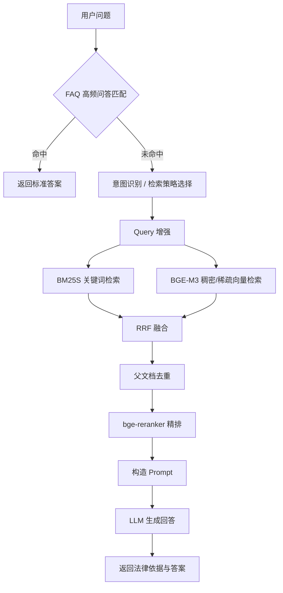

# 法律 RAG 智能问答系统

本项目是一个面向法律法规、司法解释、裁判文书等法律知识库的 RAG 智能问答系统。系统结合 FAQ 高频问答匹配、向量检索、关键词检索、Query 增强、重排序和大模型生成，支持用户进行法律知识咨询、法规依据查询和案情相关问题解答。

项目主要面向 AI 应用开发、法律知识问答、RAG 检索增强和企业级智能问答场景。

## 核心功能

- 多源法律文档解析：支持 PDF、docx、裁判文书 doc、图片等文档加载与 OCR 解析。
- 多粒度文本切分：采用父子块分层切分策略，父块使用 BERT 语义分割，子块使用中文标点递归分割。
- 混合检索召回：结合 BM25S 关键词检索、BGE-M3 稠密向量、BGE-M3 稀疏向量和 Milvus 向量数据库。
- 多路融合排序：使用 RRF 融合关键词路与向量路检索结果，并通过 bge-reranker 对候选父文档精排。
- FAQ 优先匹配：基于 MySQL + Redis + BM25 实现高频问答优先匹配，降低大模型调用成本和响应延迟。
- Query 增强策略：支持直接检索、HyDE 假设答案检索、子查询检索和回溯问题检索。
- 对话历史管理：使用 MySQL 存储多轮会话历史，支持上下文连续问答。
- Web API 服务：基于 FastAPI 提供 HTTP 查询、WebSocket 流式问答和前端页面访问。
- RAG 自动评估：支持基于 RAGAS 的 Context Precision、Context Recall、Faithfulness、Answer Relevancy 等指标评估。

## 技术栈

| 模块 | 技术 |
| --- | --- |
| 后端服务 | FastAPI、WebSocket、Uvicorn |
| 大模型调用 | DashScope / OpenAI Compatible API、Ollama |
| 向量数据库 | Milvus |
| Embedding | BGE-M3 |
| 重排序 | bge-reranker |
| 关键词检索 | BM25、BM25S、jieba |
| 数据库 | MySQL、Redis |
| 文档处理 | OCR、LangChain Document Loader、中文递归分割器、BERT 语义分割 |
| 评估 | RAGAS |

## 系统架构



## 检索链路说明

系统采用多路召回与精排结合的检索方案：

1. 高频 FAQ 问题先进入 MySQL + Redis + BM25 匹配链路，命中后直接返回标准答案。
2. 未命中 FAQ 的问题进入 RAG 检索链路。
3. 根据问题类型选择直接检索、HyDE、子查询或回溯问题等 Query 增强策略。
4. 关键词路使用 BM25S 主/增量双索引召回候选文档。
5. 向量路使用 BGE-M3 生成稠密向量和稀疏向量，在 Milvus 中进行混合检索。
6. 多路结果通过 RRF 融合，按 parent_id 进行父文档去重。
7. 使用 bge-reranker 对候选父文档进行精排，最终送入大模型生成答案。

在自建法律检索测试集上，可以使用 Hit@K、MRR@K、Avg Relevant@K 等指标评估检索质量。例如：

```text
Hit@10 = Top10 中至少命中 1 个相关法律依据的 query 数 / query 总数
```

## 目录结构

```text
integrated_qa_system/
├── app.py                         # FastAPI 服务入口
├── main.py                        # 集成问答系统入口，整合 FAQ、RAG、LLM 与会话历史
├── config.ini.example             # 配置文件示例
├── base/                          # 配置与日志模块
├── mysql_qa/                      # MySQL + Redis + BM25 高频问答模块
├── rag_qa/
│   ├── core/                      # RAG 核心模块：向量库、检索、Prompt、策略选择等
│   ├── data_dir/                  # 法律文档数据目录
│   ├── edu_document_loaders/      # 文档加载器与 OCR 解析模块
│   ├── edu_text_spliter/          # 文本切分器
│   ├── models/                    # 本地分类模型等
│   └── rag_assesment/             # RAGAS 评估脚本与数据
└── static/                        # 前端页面
```

## 环境准备

建议使用 Python 3.10+，并提前准备以下服务：

- MySQL
- Redis
- Milvus
- DashScope API Key 或本地 Ollama 模型
- 本地 embedding / reranker / BERT 模型路径

可参考以下依赖安装方向：

```bash
pip install fastapi uvicorn openai pymysql redis pymilvus
pip install langchain langchain-community langchain-text-splitters
pip install sentence-transformers FlagEmbedding torch
pip install jieba bm25s ragas
pip install modelscope
```

如果需要 OCR、PDF、Word 或图片解析，请根据实际加载器补充安装对应依赖。

## 配置说明

复制配置模板：

```bash
cp config.ini.example config.ini
```

主要配置项如下：

```ini
[mysql]
host = localhost
user = root
password = 123456
database = lawjects_kg

[redis]
host = localhost
port = 6379
password = 1234
db = 0

[milvus]
host = localhost
port = 19530
database_name = law_rag
collection_name = lawrag_final

[retrieval]
parent_chunk_size = 1200
child_chunk_size = 400
chunk_overlap = 80
retrieval_k = 50
candidate_m = 5

[model]
embedding_model = D:/nlp_model/bge-m3
reranker_model = D:/nlp_model/bge-reranker-large
bert_model = D:/nlp_model/bert-base-chinese
document_segmentation_model = D:/nlp_model/nlp_bert_document-segmentation_chinese-base
```

请根据本机模型路径、数据库账号和 API Key 修改配置。

## 数据入库

法律文档默认放在 `rag_qa/data_dir/` 下，不同来源可以按目录区分，例如：

```text
rag_qa/data_dir/
├── Law_data/
├── Judicial_Interpretation_data/
├── Administrative_regulations_data/
├── Local_regulations_data/
└── Constitution_data/
```

系统会对文档执行加载、OCR、父子块切分、embedding 生成和 Milvus 入库。

> 注意：百万级数据建议使用批量入库和离线索引构建，避免一次性加载全部文档到内存。

## 启动服务

启动 FastAPI 服务：

```bash
python app.py
```

或使用 Uvicorn：

```bash
uvicorn app:app --host 0.0.0.0 --port 8000
```

访问：

```text
http://localhost:8000
```

健康检查：

```text
GET /health
```

创建会话：

```text
POST /api/create_session
```

非流式查询：

```text
POST /api/query
```

流式问答：

```text
WebSocket /api/stream
```

## 评估指标

项目支持从检索和生成两个层面评估：

### 检索评估

- Hit@1 / Hit@3 / Hit@5 / Hit@10
- MRR@10
- Avg Relevant@10
- Recall@K

推荐自建法律检索测试集时使用：

```text
100-300 个 query
每个 query 标注 1-5 个相关法律依据
按法规查询、法律术语、处罚条件、程序要求、口语化咨询等类型分层统计
```

### RAGAS 评估

- Context Precision
- Context Recall
- Faithfulness
- Answer Relevancy

示例：

```text
在自建法律问答测试集 N=150 上，评估检索上下文质量和生成答案一致性。
```

## 项目亮点

- 采用 FAQ 优先匹配 + RAG 兜底的企业级问答架构，兼顾低延迟、低成本和复杂问题回答能力。
- 使用 BM25S 主/增量双索引，支持关键词检索索引持久化和增量更新。
- 结合 BGE-M3 稠密/稀疏向量、BM25S、RRF 和 bge-reranker，提高法律依据召回质量。
- 面向法律文档设计父子块切分策略，兼顾细粒度召回和上下文完整性。
- 提供 FastAPI + WebSocket 接口，支持流式输出和前端交互。
- 引入 RAGAS 自动评估流程，能够量化检索上下文质量和答案可信度。

## 注意事项

- `config.ini` 中包含数据库账号、API Key 和本地模型路径，提交 GitHub 前请勿上传真实密钥。
- 本项目依赖 MySQL、Redis、Milvus 和本地模型文件，首次运行前请确认服务均已启动。
- 法律问答结果仅供参考，具体案件仍需结合完整事实和现行法律规定进行判断。
- 如果用于生产环境，请增加鉴权、日志脱敏、异常监控和数据库备份机制。

## License

本项目仅用于学习、研究和工程实践展示。如需商用，请根据实际数据来源、模型许可和法律合规要求进行评估。
